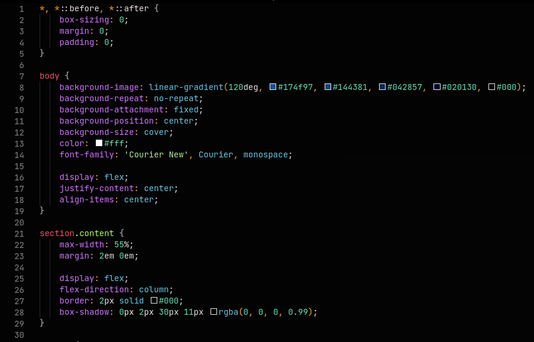
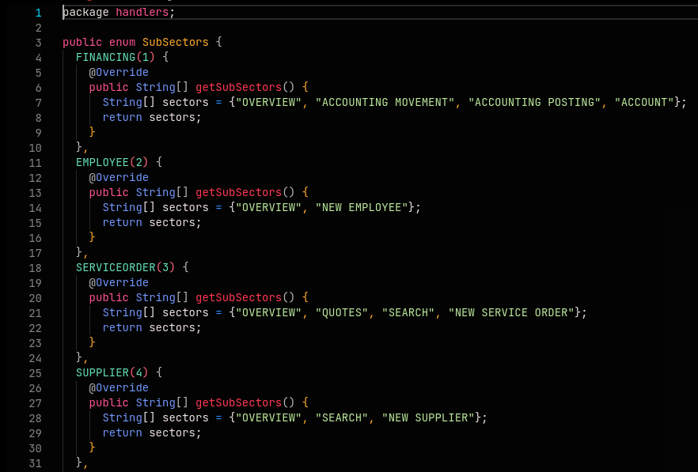
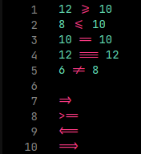

# Dark Rose 

This is a modern dark theme made for owl programmers, who's *looking for something more **readable, intuitive and creative*** with a mix of colors but at the same time with the perfect contrast.

It took inspiration from ChatGPT's code snippet theme and Mr. Robot series that I'm a fan of.

## Go straight for

* [Confession](##Confession)
* [Color theme demonstration](##Color-theme-demonstration)
* [Enhancing your experience](##Enhancing-your-experience)
* [Public TODO](##Public-TODO)

## Confession

As this is the first time I'm creating a theme, surely there'll be useless settings, redundancy and a lot of things that need to be improved, but as time pass by, I'm going to improve this theme each more.

## Color theme demonstration

The following images demonstrate how code is displayed using the theme.

### Samples

* [HTML Sample](###HTML-Sample)
* [CSS Sample](###CSS-Sample)
* [JS Sample](###JS-Sample)
* [TS Sample](###TS-Sample)
* [JSON Sample](###JSON-Sample)
* [PHP Sample](###PHP-Sample)
* [SQL Sample](###SQL-Sample)
* [PYTHON Sample](###PYTHON-Sample)
* [JAVA Sample](###JAVA-Sample)
* [MARKDOWN Sample](###MARKDOWN-Sample)
* [Macro View Sample](###Macro-View-Sample)

### HTML Sample

### CSS Sample

### JS Sample

### TS Sample

### JSON Sample

### PHP Sample

### SQL Sample

### PYTHON Sample

### JAVA Sample

### MARKDOWN Sample

### Macro View Sample

## Enhancing your experience

There are some additional settings you can make to take this experience to another level, here it goes:

### JetBrains Mono Typograph

When it comes to programming setup, it goes far beyond desk, chair, monitor and pc, but also virtual environment such as OS, IDE, color themes and finally theme, which contributes to readability and productivity, as each programmer has his own preferences, and my recomendation to you is to use **JetBrains Mono Font Family**, which looks like the following image:

### Ligatures

Although I'm still trying to understand the idea behind it, basically ligature "is" the process of merging two characters into one in order to make it more readable and intuitive - some typographs allow this cool stuff such as JetBrains Mono.

Follow the examples:

#### Don't using ligatures

#### Using ligatures

## Public TODO

Add instalation guides to `Enhancing your experience` section!